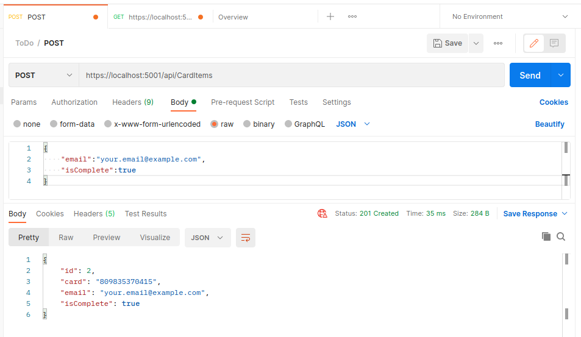
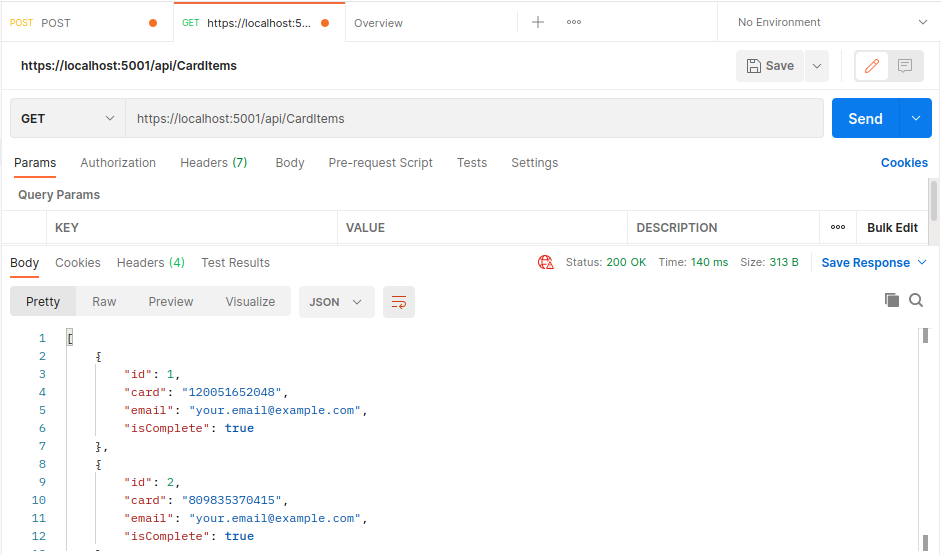

# CardApi - API REST

Para este tutorial, foi utilizado a distro Linux Mint 20.1, baseada no Ubuntu 20.04

Referência: [Web API com ASP.NET](https://docs.microsoft.com/pt-br/aspnet/core/tutorials/first-web-api?view=aspnetcore-5.0&tabs=visual-studio)
### Aviso: este projeto não implementa nenhum tipo de segurança ao armazenar dados obtidos com POST.

Pré-requisitos:
 - Visual Studio Code
 - C# para VS Code
 - SDK do .NET 5.0

1. Criação do projeto.
 - No terminal do VS Code
```bash
dotnet new webapi -o CardApi
cd CardApi
dotnet add package Microsoft.EntityFrameworkCore.InMemory
code -r ../CardApi
```
 - Selecione *Sim* para a caixa de seleção.
 - Adição de confiança no certificado de desenvolvimento HTTPS
```bash
dotnet dev-certs https --trust
```
 - No VS Code, pressione CTRL+F5 para iniciar o programa.
 - Teste se a criação do projeto deu certo em https://localhost:5001/swagger

2. Desenvolvimento da API
 - Em Properties/launchSettings.json, substitua a linha `"launchUrl": "api/swager,"` por `"launchUrl": "api/CardItems",`
 - No diretório do projeto, crie uma pasta chamada Models.
 - Crie uma classe CardItem (CardItem.cs) dentro da pasta Models e preencha o arquivo com o seguinte código:
```C#
namespace CardApi.Models
{
    public class CardItem
    {
        public long Id { get; set; }
        public string card { get; set; }
        public string email { get; set; }
        public bool IsComplete { get; set; }
    }
}
```
 - Crie um contexto de banco de dados para o Entity FrameWork Core criando a classe CardContext (CardContext.cs) dentro da pasta Models e adicione o seguinte código:
```C#
using Microsoft.EntityFrameworkCore;

namespace CardApi.Models
{
    public class CardContext : DbContext
    {
        public CardContext(DbContextOptions<CardContext> options)
            : base(options)
        {
        }

        public DbSet<CardItem> CardItems { get; set; }

    }
}
```
 - Atualize o arquivo Startup.cs removendo as chamadas do Swagger adicionando as dependências:
```C#
using Microsoft.EntityFrameworkCore;
using CardApi.Models;
```
 - E adicionando dentro do método `ConfigureServices` o seguinte código antes de `services.AddControllers();`:
```bash
services.AddDbContext<CardContext>(opt => opt.UseInMemoryDatabase("CardList"));
```
 - No terminal do VS Code:
```bash
dotnet add package Microsoft.VisualStudio.Web.CodeGeneration.Design
dotnet add package Microsoft.EntityFrameworkCore.Design
dotnet add package Microsoft.EntityFrameworkCore.SqlServer
dotnet tool install -g dotnet-aspnet-codegenerator
dotnet aspnet-codegenerator controller -name CardItemsController -async -api -m CardItem -dc CardContext -outDir Controllers
```
 - Atualize o método de criação do PostCardItem, no arquivo Controllers/CardItemController.cs:
```C#
// POST: api/CardItems
[HttpPost]
public async Task<ActionResult<CardItem>> PostCardItem(CardItem cardItem)
{
    // Generate 12 random numbers
    Random rand = new Random();
    string card_numbers = "";
    for (int i=0; i<12; i++){
        card_numbers += Convert.ToString(rand.Next(10), 10);
    }
    cardItem.card = card_numbers;
    _context.CardItems.Add(cardItem);
    await _context.SaveChangesAsync();

    //return CreatedAtAction("GetCardItem", new { id = cardItem.Id }, cardItem);
    return CreatedAtAction(nameof(GetCardItem), new { id = cardItem.Id }, cardItem);
}
```
 - O código anterior faz com que, a cada vez que o método for chamado com POST, seja criada uma sequência aleatória de 12 números, a qual representa o número aleatório do cartão.
 - Pode-se testar a API fazendo chamadas POST e GET - utilizando ferramentas como Postman, por exemplo - na URL https://localhost:5001/api/CardItems
 - Para POST, envia-se um JSON do tipo:
```JSON
{
    "email":"your.email@example.com",
    "isComplete":true
}
```



A partir daqui, é preciso fazer alguns avisos.
 1. O estado do projeto cria números de cartões aleatórios para cada chamada com POST, de modo que é armazenado no banco de dados a associação em JSON da combinação de Id, email, código do cartão e verificação de completude.
 2. É possível ver todos as entradas criadas através de um método por GET, verificando emails e números de cartões, porém não foi implementada a lógica que manteria um conjunto de emails para um único email, além da criação de mais de um número de cartão para cada email.
 3. Além disso, a lógica de criação de números aleatórios não armazena os números de forma segura e nem verifica se um determinado número já havia sido criado.

O que falta implementar:
Basicamente, seria necessário implementar as lógicas de unicidade de armazenamento para os números respectivos aos emails, muito provavelmente usando verbos como PATCH, ao invés de POST, para edição dos valores armazenados para determinado email.
Também é preciso garantir que cada número de cartão seja único, além de guardar essa informação de forma segura, encriptando os números de modo que nem os próprios programadores tivessem acesso aos números.
